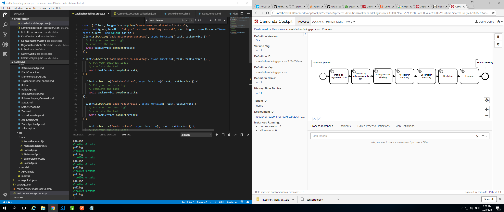

# Camunda Zaken

> !NOTE, this is a test project for using BPMN (Camunda) with GEMMA Zaakgericht werken processes. The project is under heavy development and is currently unstable.

|   |   |   |   |   |  |  |  |  | 
|:--------:|:--------:|:--------:|:--------:|:--------:|--------:|:--------:|:--------:|:--------:|
| [camunda](https://camunda.com)  | [postman](https://www.getpostman.com)  |  [vscode](https://code.visualstudio.com)  |  [nodejs](https://nodejs.org)  |   ([npm](https://www.npmjs.com)    | [openapi](https://www.openapis.org) | [loopback](https://loopback.io) |  [docker](https://www.docker.com) |[kubernetes](https://kubernetes.io)| 

## GEMMA Client-API's

Gemma client api interface are generated from Common Ground openapi.yaml openAPI3.0 definitions for nodejs applications. The yaml definitions have been downgraded to openAPI 2.0 (a.k.a. swagger 2.0) because more code generation tools are supported for this version.

* [Betrokkenen    ](zrc-client/docs/BetrokkenenApi.md     "Betrokkenen API documentation")
* [Klantcontacten ](/zrc-client/docs/KlantcontactenApi.md "Klantcontacten API documentation")
* [Rollen         ](/zrc-client/docs/RollenApi.md         "Rollen API documentation")
* [Statussen      ](/zrc-client/docs/StatussenApi.md      "Statussen API documentation")
* [Zaakobjecten   ](/zrc-client/docs/ZaakobjectenApi.md   "Zaakobjecten API documentation")
* [Zaken          ](/zrc-client/docs/ZakenApi.md          "Zaken API documentation")

## GEMMA Server API's

Gemma server api's are generated from Common Ground openapi.yaml openAPI3.0 definitions for nodejs applications. The yaml definitions have been downgraded to openAPI 2.0 (a.k.a. swagger 2.0) because more code generation tools are supported for this version.

Loopback is used on these definitions to generate the API implementations to create the models for data storage.

## Install

use: npm install 
install default docker image from camunda 
install postman for using the configuration files under integration-tests folder 
install camunda modeler 
deploy the zaakbehandelingsproces.bpmn using the modeler

### loopback
If you want to roll your own API's based on the openAPI definitions in the project, you will need to install the loopback cli:

npm i -g @loopback/cli

### Database support (through Juggler)

By default the project currently comes with in Memory database datasource (IBM strongloop) but other datasources can be injected.

<table>
  <thead>
    <tr>
      <th>Database type</th>
      <th>Package name</th>
      <th>Maintainer</th>
      <th>Build status / coverage</th>
    </tr>
  </thead>
  <tbody>
    <!-- ArangoDB -->
    <tr>
      <td> ArangoDB</td>
      <td><a href="https://github.com/m0ppers/jugglingdb-arango">jugglingdb-arango</a></td>
      <td><a href="https://github.com/m0ppers">Andreas Streichardt</a></td>
      <td></td>
    </tr>
    <!-- Firebird -->
    <tr>
      <td> Firebird</td>
      <td><a href="http://github.com/hgourvest/jugglingdb-firebird">jugglingdb-firebird</a></td>
      <td><a href="http://github.com/hgourvest">Henri Gourvest</a></td>
    </tr>
    <!-- MongoDB -->
    <tr>
      <td> MongoDB</td>
      <td><a href="https://github.com/jugglingdb/mongodb-adapter">jugglingdb-mongodb</a></td>
      <td><a href="https://github.com/1602">Anatoliy Chakkaev</a></td>
      <td> </td>
    </tr>
    <!-- MySQL -->
    <tr>
      <td> MySQL</td>
      <td><a href="https://github.com/jugglingdb/mysql-adapter">jugglingdb-mysql</a></td>
      <td><a href="https://github.com/dgsan">dgsan</a></td>
      <td> </td>
    </tr>
    <!-- CouchDB / nano -->
    <tr>
      <td> CouchDB / nano</td>
      <td><a href="https://github.com/jugglingdb/nano-adapter">jugglingdb-nano</a></td>
      <td><a href="https://github.com/nrw">Nicholas Westlake</a></td>
      <td></td>
    </tr>
    <!-- PostgreSQL -->
    <tr>
      <td> PostgreSQL</td>
      <td><a href="https://github.com/jugglingdb/postgres-adapter">jugglingdb-postgres</a></td>
      <td><a href="https://github.com/1602">Anatoliy Chakkaev</a></td>
      <td> </td>
    </tr>
    <!-- Redis -->
    <tr>
      <td> Redis</td>
      <td><a href="https://github.com/jugglingdb/redis-hq-adapter">jugglingdb-redis-hq</a></td>
      <td><a href="https://github.com/1602">Anatoliy Chakkaev</a></td>
      <td> </td>
    </tr>
    <!-- RethinkDB -->
    <tr>
      <td> RethinkDB</td>
      <td><a href="https://github.com/fuwaneko/jugglingdb-rethink">jugglingdb-rethink</a></td>
      <td><a href="https://github.com/fuwaneko">Tewi Inaba</a></td>
      <td></td>
    </tr>
    <!-- SQLite 3 -->
    <tr>
      <td> SQLite</td>
      <td><a href="https://github.com/jugglingdb/sqlite3-adapter">jugglingdb-sqlite3</a></td>
      <td><a href="https://github.com/anatoliychakkaev">Anatoliy Chakkaev</a></td>
      <td> </td>
    </tr>
    <tr>
      <td>WebService</td>
      <td>built-in</td>
      <td><a href="https://github.com/1602">Anatoliy Chakkaev</a></td>
      <td>n/a</td>
    </tr>
    <tr>
      <td>Memory (bogus)</td>
      <td>built-in</td>
      <td><a href="https://github.com/1602">Anatoliy Chakkaev</a></td>
      <td>n/a</td>
    </tr>
    <!-- DynamoDB -->
    <tr>
      <td><a href="http://en.wikipedia.org/wiki/Amazon_DynamoDB"> DynamoDB </a></td>
      <td><a href="https://github.com/tmpaul/jugglingdb-dynamodb">jugglingdb-dynamodb</a></td>
      <td><a href="https://github.com/tmpaul">tmpaul</a></td>
      <td></td>
    </tr>
    <tr>
      <td><a href="http://www.microsoft.com/en-ca/server-cloud/products/sql-server/">SQL Server<a></td>
      <td><a href="https://github.com/Quadrus/jugglingdb-mssql">jugglingdb-mssql</a></td>
      <td><a href="https://github.com/Quadrus">Quadrus</a></td>
      <td>n/a</td>
    </tr>
    <tr>
      <td><a href="https://msdn.microsoft.com/en-us/library/azure/jj553018.aspx">Azure Table Storage<a></td>
      <td><a href="https://github.com/yads/jugglingdb-azure-tablestorage">jugglingdb-azure-tablestorage</a></td>
      <td><a href="https://github.com/yads">Vadim Kazakov</a></td>
      <td>n/a</td>
    </tr>

  </tbody>
</table>

## Usage

run node ./zaakbehandelingsproces.js
run the postman collection to triger a new process

## Screenshots of IDE's

 

## Contribute

PRs accepted.

## License

EUPL-1.2 © Sjef van Leeuwen
