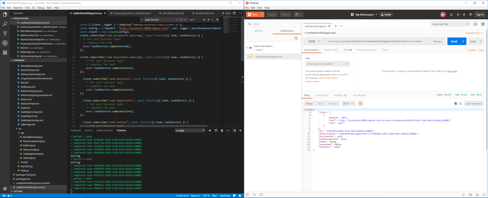

# Camunda Zaken

> This is a test project for using BPMN (Camunda) with GEMMA Zaakgericht werken processes.

## Install

use: npm install 
install default docker image from camunda 
install postman for using the configuration files under integration-tests folder 
install camunda modeler 
deploy the zaakbehandelingsproces.bpmn using the modeler

## Usage

run node ./zaakbehandelingsproces.js
run the postman collection to triger a new process

## Screenshots of IDE's

 

## Contribute

PRs accepted.

## License

EUPL-1.2 © Sjef van Leeuwen